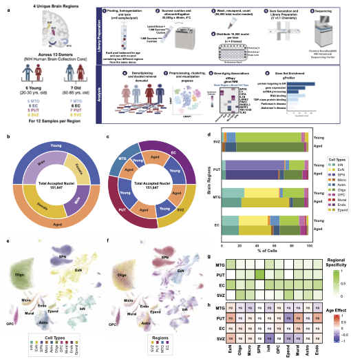

# ADRD_Brain_Aging
## Phase 1: single-nuclei RNA atlas between young and aged subjects in four brain regions

- Where 'young' subjects were between 20-30 years of age at time of death and 'aged' were 60-85 years of age at time of death
- Brain regions included for each subject are: Enorhinal cortex (EC), Middle Temporal Gyrus (MTG), Subventricular Zone (SVZ), and Putamen (PUT)
  
## Phase 2: future work
- Expansion in the number of subjects included and analyses using age as a continuous variable
- Focus on a single brain region for the expanded subject series
- Multiome
