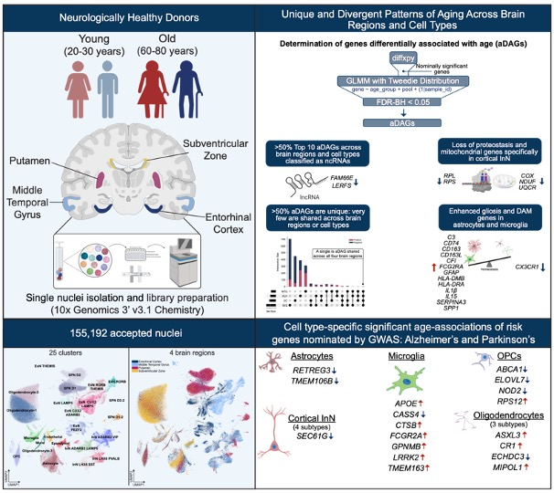

# ADRD_Brain_Aging Phase 1

- single-nuclei atlas between young and old subjects in four brain regions
- Where 'young' subjects were between 20-30 years of age at time of death and 'old' were 60-80 years of age at time of death
- brain regions included for each subject are: putamen, entorhinal cortex, middle temporal gyrus, and subventricular zone

## Analyses
### Demultiplexing
    - use subject genotypes to deconvolute cells from pools and assign each cell to a subject using Demuxlet to eastablish identity based on genotype
    1. quantifications/prep_hbcc_genos.ipynb
    2. quantifications/prep_pool_sample_info.ipynb
    3. quantifications/run_demuxlet_wdl_job.ipynb
    4. quantifications/create_anndata_with_demuxlet_identified_donors.ipynb
    5. quantifications/combine_demultiplexed_pool_anndatas.ipynb
### Clustering and cell-type identification
    1. quantifications/pegasus_analysis.ipynb
    2. quantifications/subset_recluster.ipynb
### Differential expression analysis by age group
    1. analyses/frmt_glmmtmb_diffexp.ipynb
        a. frmt_broad_types_by_region_glmmtmb_prep.ipynb
    2. analyses/manually_run_glmmTMB_GCP.md and glmmTMB.R
    3. analyses/post_glmmtmb_diffexp.ipynb
### Check ambient RNA and non-genotype doublets relative to doublets and ambigious reads from demux and 'uncertain' cell-type clusters
    1. quantifications/run_cellbender_wdl_job.ipynb
    2. quantifications/cellbender_results.ipynb
    3. quantifications/scrublet.ipynb
### Replication of differential analysis
    1. quantifications/combine_replication_samples.ipynb
    2. quantifications/replication_scrublet.ipynb
    3. quantifications/combine_ref_disc_rep.ipynb
    4. quantifications/cluster_replication_data.ipynb
    5. analyses/replication_glmmtmb_prep.ipynb
    6. manually_run_glmmTMB_GCP.md and glmmTMB.R
    7. analyses/replication_post_glmmtmb_diffexp.ipynb
    8. quantifications/replication_scrublet.ipynb
### Other development and testing code
    1. other clustering and processing testing not used for analysis; scanpy_cluster_analysis.ipynb and scvi_id_zi_features.ipynb
    2. other analyses types run for testing but not used for analysis; glmm_diffexp.ipynb, glmmtmb_diffexp.ipynb, and glm_pb_diffexp.ipynb with corrsponding post processing notebooks and comparisons. post_glm_pb_diffexp.ipynb, post_glmm_diffexp.ipynb, post_glmm_zi_diffexp.ipynb, and compare_de_methods.ipynb
    3. other ways of launching or running Cellbnder and Scrublet