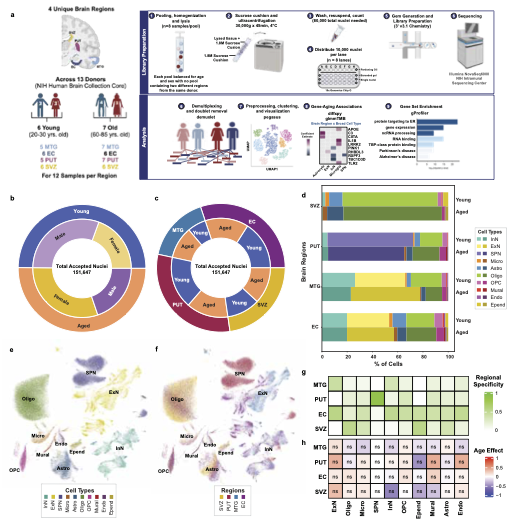

# ADRD_Brain_Aging Phase 1

## Link to bioRxiv Pre-Print:
*Region-Specific Transcriptional Signatures of Brain Aging in the Absence of Neuropathology at the Single-cell Level*

Monica E. Mesecar, Megan F. Duffy, Dominic J. Acri, Jinhui Ding, Rebekah G. Langston, Syed I. Shah, Mike A. Nalls, Xylena Reed, Sonja W. Scholz, D. Thad Whitaker, Pavan K. Auluck, Stefano Marenco, Alex R. DeCasien, J. Raphael Gibbs, Mark R. Cookson
bioRxiv 2023.07.31.551097; doi: https://doi.org/10.1101/2023.07.31.551097

 ## Description:
Single-nucleus RNA sequencing study of postmortem human brain tissue samples across four brain regions: the entorhinal cortex (EC), middle temporal gyrus (MTG), subventricular zone (SVZ), and putamen (PUT).

Samples were obtained from both Young individuals (aged 20-30 years, n=6) and Aged individuals (aged 60-85 years, n=7) from the NIH Human Brain Collection Core. 

## Questions & Results Summary:
* What brain cell types exist within these regions?
    * 10 broad cell types from 151, 647 nuclei (Pegasus)
* How do cell type proportions change with age?
    * Found no statistically significant changes in cell type proportions due to age (R, speckle).
* How do the gene expression profiles of different cell types change with age? And do these profiles vary by region?
    * Custom differential expression analysis (Generalized Linear Mixed Model with Tweedie distribution) yielded over 8,000 age-associated differentially-expressed genes (aDEGs).
    * Gene expression profiles were both cell type- and region-specific with most aDEGs within a cell type being specific to a given region.
    * Functional Enrichment analysis (R, gProfiler2) with background correction revealed unique functional enrichment trends for a given cell type, with enrichments varying by region.

## Pre-Processing & Clustering Workflow

### Demultiplexing
    - use subject genotypes to deconvolute cells from pools and assign each cell to a subject using Demuxlet to eastablish identity based on genotype
    1. quantifications/prep_hbcc_genos.ipynb
    2. quantifications/prep_pool_sample_info.ipynb
    3. quantifications/run_demuxlet_wdl_job.ipynb
    4. quantifications/create_anndata_with_demuxlet_identified_donors.ipynb via pm_nb_runners/create_demuxed_anndata_runner.ipynb  
    5. quantifications/combine_demultiplexed_pool_anndatas.ipynb
    
### Clustering and cell-type identification
    1. quantifications/pegasus_analysis.ipynb
    2. quantifications/subset_recluster.ipynb
    3. quantifications/manually_add_broad_celltypes.ipynb
    
### Differential expression analysis by age group
    1. analyses/frmt_glmmtmb_diffexp.ipynb via pm_nb_runners/glmmtmb_diffexp_runner.ipynb
        a. analyses/frmt_broad_types_by_region_glmmtmb_prep.ipynb
    2. analyses/manually_run_glmmTMB_GCP.md and glmmTMB.R
    3. analyses/post_glmmtmb_diffexp.ipynb
    
### Check ambient RNA and non-genotype doublets relative to doublets and ambigious reads from demux and 'uncertain' cell-type clusters
    1. quantifications/run_cellbender_wdl_job.ipynb
    2. quantifications/cellbender_results.ipynb
    3. quantifications/scrublet.ipynb

## Analysis & Figures Code 
* Figure 1A: Design & Workflow--Biorender 
* Figure 1B/C: Nuclei Distribution--Adaptation of Supplemental Fig. 1 Donut Plots (see below)
* Figure 1D/E, Supp. Fig. 2: UMAP Creation 	https://github.com/neurogenetics/ADRD_Brain_Aging/blob/main/phase1/development/revamp2024/Monica/P1_UMAPs_Fig1_SuppFig2.ipynb 
* Figure 1F: Proportion Bars 	https://github.com/neurogenetics/ADRD_Brain_Aging/blob/main/phase1/development/revamp2024/Monica/P1_Proportions_Bars_Fig1.ipynb 
* Figure 1G: Regional Specificity Heatmap / Figure 1H: Speckle Proportion analysis heat map	https://github.com/neurogenetics/ADRD_Brain_Aging/blob/main/phase1/development/revamp2024/Monica/P1_ProportionAndSpecificity_Figure1.R 
* Figures 2-4, Supp. Fig. 7: Cell Type x Region UpSet Plot Function	https://github.com/neurogenetics/ADRD_Brain_Aging/blob/main/phase1/development/revamp2024/Monica/P1_aDEG_UpSets.ipynb 
* Figures 2-4, Supp. Figs. 6-7: Concordance/Discordance Heatmaps
  * Input Dataframe:
https://github.com/neurogenetics/ADRD_Brain_Aging/blob/main/phase1/development/revamp2024/Monica/P1_ConDis_HM_Input_Dataframe_Code.R
  * Heatmap Generation: 
https://github.com/neurogenetics/ADRD_Brain_Aging/blob/main/phase1/development/revamp2024/Monica/P1_ConDiscordance_HeatmapPlot_function.R 
* Figures 2-4: GProfiler Functional Enrichment Analysis with Background Correction	https://github.com/neurogenetics/ADRD_Brain_Aging/blob/main/phase1/development/revamp2024/Dom/MultipleEnrichments_CorrectAndSummarize_Oct2024.R 
* Figures 2-4: Top 10 Functional Enrichments by Region Plots for each Cell Type (with Background Correction)	https://github.com/neurogenetics/ADRD_Brain_Aging/blob/main/phase1/development/revamp2024/Monica/P1_BackgroundCorr_EnrichPlots_Top10perRegion.ipynb 
* Supp. Fig. 1: Demographics Charts	https://github.com/neurogenetics/ADRD_Brain_Aging/blob/main/phase1/development/revamp2024/Monica/P1_Supp1_Donor_Sample_Demographics.ipynb 
* Supp. Fig. 2: Marker Gene Dot Plots	https://github.com/neurogenetics/ADRD_Brain_Aging/blob/main/phase1/development/revamp2024/Monica/P1_MarkerGenes_DotPlot.ipynb 
* Supp. Fig. 3: SPN Subclustering 	https://github.com/neurogenetics/ADRD_Brain_Aging/blob/main/phase1/development/revamp2024/Monica/Phase1_SPN_AddressingRegion.R 
* Supp. Fig. 4: aDEG Typing 	https://github.com/neurogenetics/ADRD_Brain_Aging/blob/main/phase1/development/revamp2024/Monica/P1_Gene_Type_Plot.ipynb 
* Supp. Fig. 5: aDEG Directionality 	https://github.com/neurogenetics/ADRD_Brain_Aging/blob/main/phase1/development/revamp2024/Monica/P1_aDEG_Direction_Plot.ipynb 

